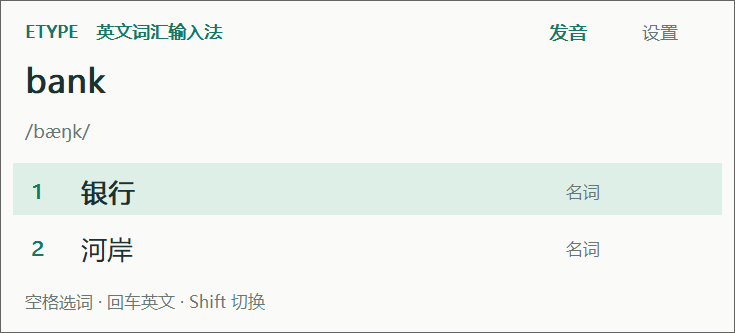

# EType 0.1.1

Windows 英文词汇输入法。输入完整英文单词，选择中文释义。


第一版支持离线词库、一词多义、词形变化、按空格触发纠错、固定候选顺序、
音标/词性、手动离线英语发音、英文直输与中英文标点。默认美式发音。

[下载 Windows EXE 安装包](releases/EType-0.1.1-Setup.exe)。
适用于 Windows 10/11 x64，包含 32 位和 64 位输入法组件。安装向导为中文，
在“选择安装位置”页面可点击“浏览”，自主选择本地磁盘上的独立空文件夹。
支持中文、空格及 `&` 等字符路径。系统注册需要 Windows 管理员授权。



## 使用

构建后的程序在 `build/EType/EType.exe`。运行后点击“直接试用（无需安装）”，
在本窗口输入 `bank` 并按 `2`，应输出“河岸”。输入 `apple` 按空格输出“苹果”。

运行 EXE 安装包后，从系统输入法列表选择 EType 即可在其他软件里使用。
可从 Windows 已安装的应用、安装目录的 `unins000.exe` 或设置窗口卸载。
本版不覆盖升级：更新或更换路径请先卸载再安装，个人偏好会保留。
卸载只移除安装器拥有的文件，保留用户后来加入的文件。
旧版手动注册用户请先运行旧目录中的卸载功能，不能直接移动已注册的目录。
完整说明见 [使用说明](docs/使用说明.txt)。

## 源码和构建

- `src/core.*`：离线查询、纠错及输入状态机。
- `src/tsf.cpp`：原生 COM/TSF 输入服务、组合文字、候选和注册。
- `src/platform.*`：候选窗口、偏好和发音启动。
- `src/app.cpp`：设置、组件试用、SAPI 离线发音与诊断。
- `src/editor_store.h`：组件试用窗口的 TSF 文字宿主。
- `scripts/build_dictionary.py`：可重复生成词库，保留源文件哈希与许可。
- `scripts/build.ps1`：构建 x64/x86 DLL、设置程序并运行测试。

构建需要 Python 3 和 LLVM MinGW，不需要安装 .NET SDK。
本项目开发工具保存在 `tools/` 中；运行发布包不需要这些工具。

```powershell
python tools/bootstrap.py
powershell.exe -NoProfile -ExecutionPolicy Bypass -File scripts/build.ps1
python scripts/package.py
powershell.exe -NoProfile -ExecutionPolicy Bypass -File tools/bootstrap-installer.ps1
powershell.exe -NoProfile -ExecutionPolicy Bypass -File scripts/build-installer.ps1 -Validation
python tests/installer_tests.py
powershell.exe -NoProfile -ExecutionPolicy Bypass -File scripts/build-installer.ps1
```

本机工具链版本与下载地址记录在 `tools/toolchain-release.json`。
安装器使用经签名核验的官方 Inno Setup 6.7.3，版本、来源和哈希记录在
`tools/installer-toolchain.json`。正式安装器仅在当前包和安装流程测试都通过时生成。
词库基于 [ECDICT](https://github.com/skywind3000/ECDICT)，源文件和派生数据哈希
记录在 `data/manifest.json`。候选编辑覆盖项见 `data/overrides.json`。

## 验证边界

核心状态机测试和真实 Windows TSF 组合/提交测试在构建时运行。
TSF 测试使用进程内临时配置，让 Windows 创建并激活实际 DLL，再调用
其按键接口验证文字提交；它不安装全局配置，也不验证系统向其他应用的按键路由。

设置程序的 `--ui-selftest <report.json>` 在真实试用文本框中验证组件；
该宿主使用同一个输入法 DLL 和 Windows TSF 上屏接口，并自行转交按键。
因此组件试用成功与系统安装成功、微信/Word/浏览器兼容是分别验证的事项。

本次核心检查 64 项、两种架构 TSF 检查各 73 项、词库回归 7 组及真实试用框全部通过。
安装器 32 项检查覆盖自选目录、失败回滚、文件占用、用户文件保留、卸载和重新安装。
安装生命周期测试使用同源单独编译的隔离安装器，避免改变现有系统输入法注册；
正式版的全局注册及外部软件兼容尚需在目标电脑安装验收。详见 [验证记录](docs/验证记录.md)。
用户选定的快捷候选条已记录在 [UI 设计决策](docs/UI设计.md)，原生窗口仍为现有版式。

发音依赖本机离线 SAPI 英语音源。本机美式可用，英式未安装。
源词库音标部分为英式，不会把它们自动标为美式音标。
目前聚焦桌面文本服务；现代应用、受保护输入区域和第三方软件需分别验收。

## 接口参考

- [Microsoft TSF 注册说明](https://learn.microsoft.com/en-us/windows/win32/tsf/text-service-registration)
- [文字编辑会话](https://learn.microsoft.com/en-us/windows/win32/api/msctf/nf-msctf-itfcontext-requesteditsession)
- [输入配置注册](https://learn.microsoft.com/en-us/windows/win32/api/msctf/nf-msctf-itfinputprocessorprofilemgr-registerprofile)
- [SAPI 发音音源](https://learn.microsoft.com/en-us/previous-versions/windows/desktop/ms719807(v=vs.85))
